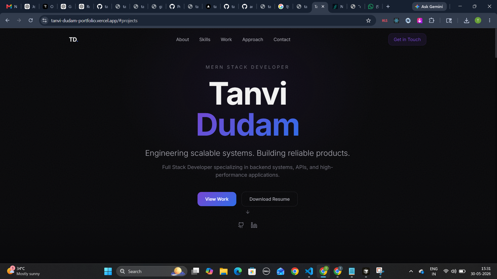
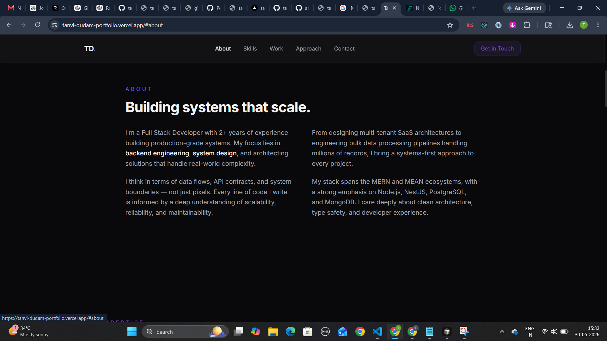
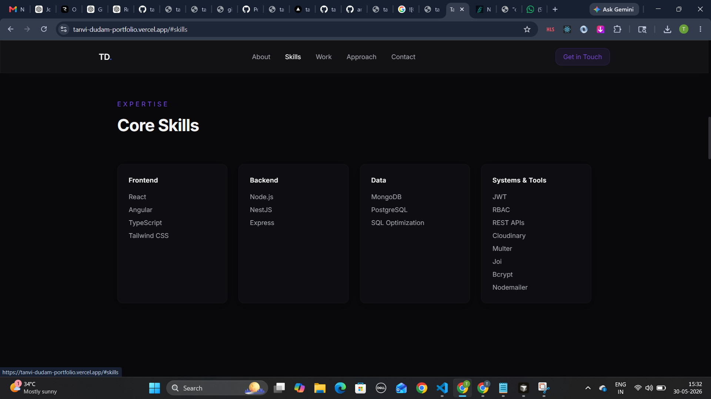
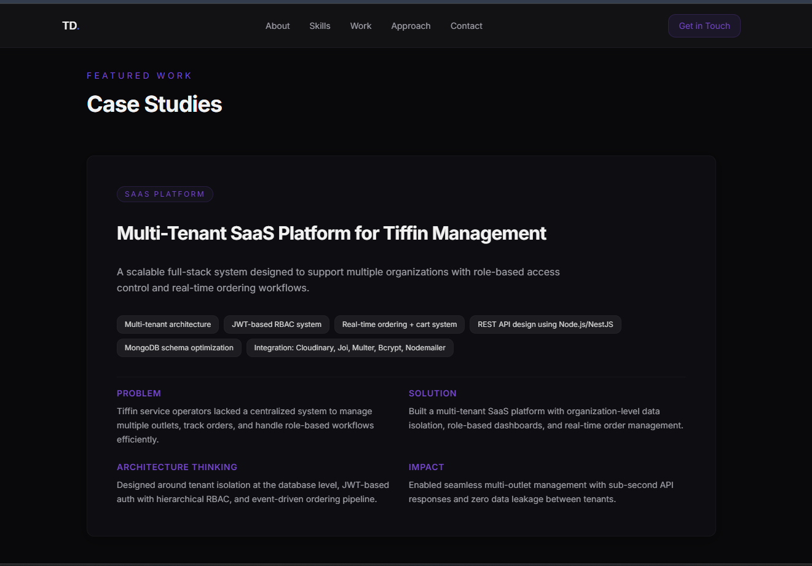
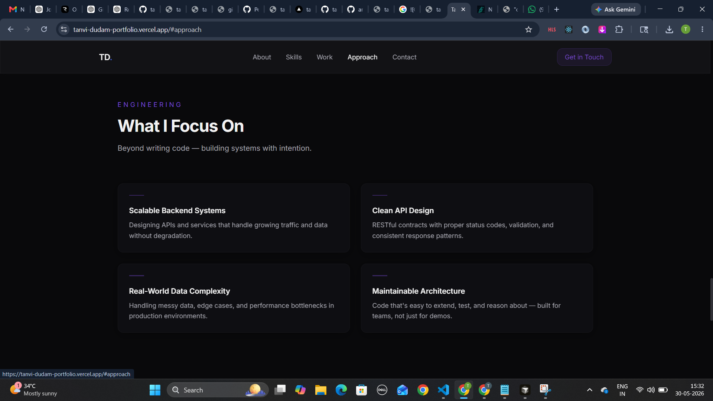
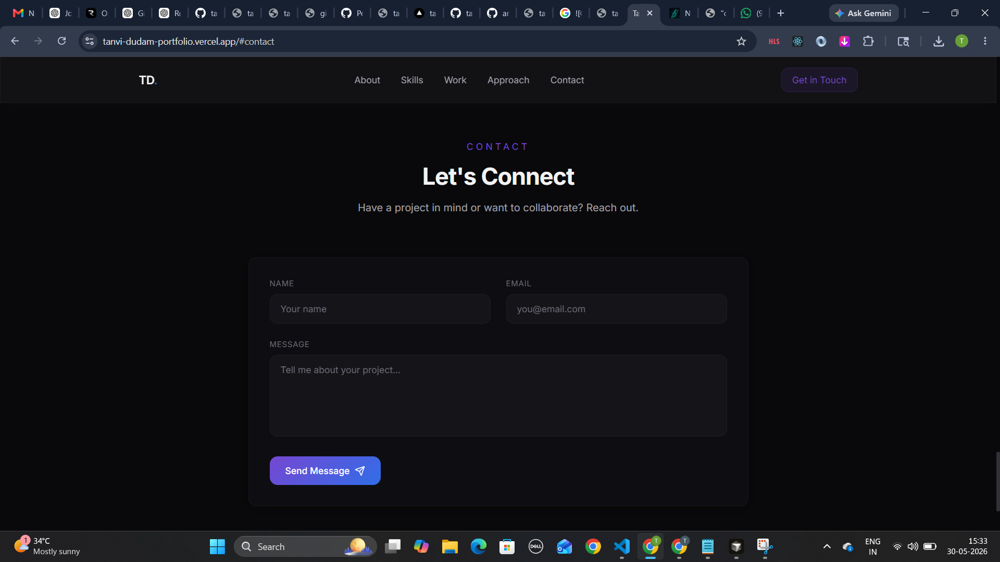
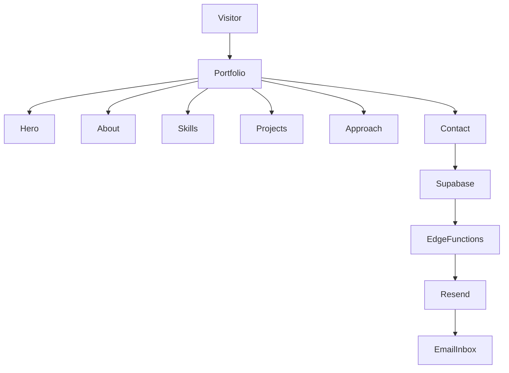

# Personal Portfolio

A modern developer portfolio showcasing scalable backend systems, system design expertise, SaaS architecture, and production-grade applications.

🌐 Live Demo: https://tanvi-dudam-portfolio.vercel.app

---

## Overview

This portfolio represents my work as a Full Stack Developer with a strong focus on backend engineering, API architecture, scalable systems, and real-world problem solving.

The website highlights my professional experience, technical expertise, featured engineering projects, and development philosophy through an interactive and responsive user experience.

Rather than functioning as a traditional portfolio, the platform is designed to communicate how I approach software engineering, system design, scalability, and product development.

---

## Features

### Hero Section

- Professional introduction
- Resume download
- GitHub integration
- LinkedIn integration
- Personal branding

---

### About

Highlights:

- 2+ years of professional experience
- Backend-focused engineering mindset
- System design expertise
- Production-grade application development
- Scalable architecture thinking

---

### Core Skills

#### Frontend

- React
- Angular
- TypeScript
- Tailwind CSS

#### Backend

- Node.js
- NestJS
- Express.js

#### Databases

- MongoDB
- PostgreSQL
- SQL Optimization

#### Systems & Tools

- JWT Authentication
- RBAC Authorization
- REST APIs
- Cloudinary
- Multer
- Joi Validation
- Bcrypt
- Nodemailer

---

### Featured Case Studies

#### Multi-Tenant SaaS Platform for Tiffin Management

A scalable full-stack system supporting multiple organizations through tenant isolation and role-based access control.

Key Engineering Areas:

- Multi-tenant architecture
- JWT authentication
- Hierarchical RBAC
- REST API design
- MongoDB schema optimization
- Real-time ordering workflows

---

#### Bulk Excel Processing Platform

Backend-focused processing engine built for handling large Excel datasets efficiently.

Key Engineering Areas:

- Stream-based processing
- Worker threads
- Batch database operations
- Memory optimization
- Parallel processing

---

## Screenshots

### Hero Section



---

### About Section



---

### Skills Section



---

### Featured Projects



---

### Engineering Approach



---

### Contact Form



---

### Engineering Philosophy

#### Scalable Backend Systems

Designing APIs and services capable of handling growing traffic and increasing business complexity.

#### Clean API Design

Building predictable RESTful interfaces with proper validation, security, and maintainability.

#### Real-World Data Complexity

Solving production challenges involving large datasets, edge cases, and performance bottlenecks.

#### Maintainable Architecture

Creating systems that remain extensible, testable, and easy to evolve over time.

---

### Contact System

The portfolio includes a fully functional contact workflow with:

- Form validation
- Spam protection
- Secure email delivery
- Serverless backend integration
- Real-time notifications

---

## Tech Stack

### Frontend

- React
- TypeScript
- Vite
- Tailwind CSS
- Framer Motion

### UI Components

- shadcn/ui
- Radix UI
- Lucide Icons

### Backend Services

- Supabase
- Edge Functions
- Resend

### State & Data

- React Query
- React Hook Form
- Zod

### Deployment

- Vercel
- Supabase

---

## Architecture



---

## Installation

### Clone Repository

```bash
git clone <repository-url>
```

### Install Dependencies

```bash
npm install
```

### Configure Environment Variables

```env
VITE_SUPABASE_URL=your_supabase_url
VITE_SUPABASE_PUBLISHABLE_KEY=your_supabase_key
```

### Start Development Server

```bash
npm run dev
```

---

## Build

```bash
npm run build
```

---

## Deployment

The application is deployed using:

- Vercel
- Supabase
- Resend

---

## Author

### Tanvi Dudam

Full Stack Developer

Backend Engineering • System Design • Scalable Architectures

🌐 Portfolio: https://tanvi-dudam-portfolio.vercel.app

💼 LinkedIn: https://linkedin.com/in/tanvi-dudam

🐙 GitHub: https://github.com/tanvi-2103-git
